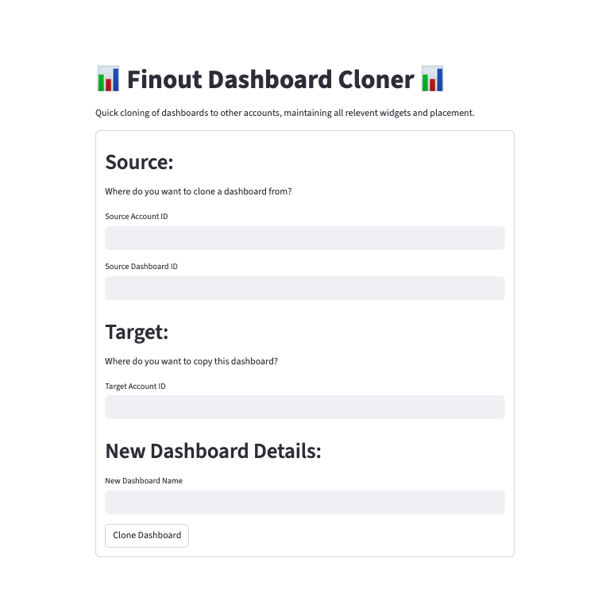

# Finout Dashboard Cloner

   This project is a Streamlit application that allows users to quickly clone dashboards to other accounts, maintaining all relevent widgets and placement. If you clone a dashboard with account specific virtual tags, unit economics and other metrics, the dashboard will clone successfully, but it will either show no data in those widgets or throw a warning on the dashboard that it was unable to load. For these cases, you will need to either delete the unnesesary widgets or edit them with the accounts metrics you cloned into.

   

## Requirements

- Python 3.7 or higher
- Streamlit

## Installation

Clone the repository:
   ```sh
   git clone https://github.com/finout-io/dashboard-cloner.git
   cd dashboard-cloner
   ```

Create a virtual environment:
   ```sh
   python3 -m venv venv
   source venv/bin/activate
   ```
Install dependencies:
   ```sh
   pip install -r requirements.txt
   ```

## Running the Application

To run the application, use the following command:

   ```sh
   streamlit run streamlit_app.py
   ```

# How to:
1. **Connect to VPN**
2. **Fill Out the Form**: Enter values for all fields.
3. **Submit the Form**: Click the "Submit" button to submit the form.
4. **Validate in Finout**: Once submitted with a success message, check the **target** finout tenant for the cloned dashboard.

### Form Field Details
- **Source Account ID**: Account ID of the source you want to clone **from**.
- **Source Dashboard ID**: ID of Dashboard you want to clone.
- **Target Account ID**: Account ID of the target you want to clone **to**
- **New Dashboard Name**: Name your new dashboard

# Issues and Contributions

If you encounter any issues, feel free to open an issue in the repository. Contributions are welcome to improve the project.
